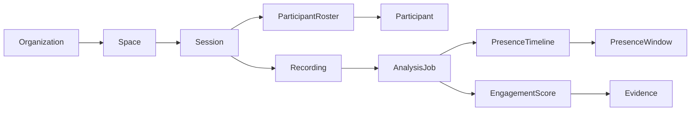

# Studentlytics Platform Blueprint

Studentlytics is a presence intelligence platform for organized learning and event sessions: university classrooms, company training, webinars, conferences, workshops, Zoom calls, and Google Meet recordings.

The product answers four questions:

1. Who attended?
2. When did each person check in and check out?
3. Who left early or disappeared mid-session?
4. Who was engaged, participating, or at risk of disengagement?

## Core Users

- Organizer: creates sessions, uploads recordings, reviews reports.
- Instructor or speaker: sees attendance, engagement, participation, and drop-off trends.
- Administrator: manages rosters, consent, retention, exports, and integrations.
- Participant: can view their own attendance and engagement history when enabled.

## Session Types

- Classroom: fixed room camera, professor teaching, students seated.
- Webinar: speaker plus attendee grid, often camera-off participants.
- Conference: large room, badge or roster-backed attendance, multiple sessions.
- Company training: employee roster, compliance attendance, completion reports.
- Virtual meeting: Zoom, Google Meet, Teams, or uploaded recordings.

## Capture Modes

### Current MVP

Uploaded recording:

- Organizer uploads MP4/MOV/WebM.
- Backend samples frames, recognizes enrolled faces, transcribes audio, and builds attendance plus engagement output.
- Product returns per-person attendance, engagement score, check-in, check-out, visible duration, early-leave flag, and participation signals.

### Next

Live session monitor:

- A live room or meeting stream is processed in short windows.
- Presence timeline updates every few seconds.
- Clock-in is first verified appearance.
- Clock-out is last verified appearance after a configurable absence timeout.
- If the person returns, the timeline stores multiple presence windows.

### Later

Native meeting integrations:

- Zoom, Google Meet, Teams, LMS, HRIS, and event-platform integrations should feed session metadata, rosters, recordings, and exports.
- The core analytics engine should stay provider-independent.

## Product Data Model

Important entities:

- Organization: university, company, event organizer.
- Space: course, cohort, department, event track, training program.
- Session: one class, webinar, conference talk, or training block.
- Participant: student, employee, attendee, learner, guest.
- Enrollment: participant membership in a space or event.
- Recording: uploaded video or live stream archive.
- PresenceWindow: `{ start, end, duration_seconds }` for one continuous appearance.
- AttendanceDecision: present, absent, late, left early, camera-off present, unknown.
- EngagementScore: visual presence, participation, interaction, consistency, and confidence.

## Engagement Score

The score must be explainable. It should never be a mysterious judgment about a person.

Current MVP:

- Visual presence: face visible, match confidence, visibility consistency.
- Participation: words spoken relative to the session.
- Interaction: questions asked or discussion signals.
- Consistency: stayed present instead of appearing briefly and leaving.
- Camera-off participation: can mark a person present if speech attribution proves participation.

Future model:

- Focus posture and gaze should be confidence-weighted and optional.
- Conversation quality should be based on transcript evidence.
- Scores should show evidence and confidence, not only a number.

## Privacy and Trust Requirements

- Require organizer confirmation that participants were notified and consented where required.
- Store face encodings locally or inside the customer-controlled environment whenever possible.
- Keep raw recordings only as long as configured.
- Show evidence behind every attendance or engagement decision.
- Support manual override with audit trail.
- Never use engagement score as the sole basis for discipline, grading, employment, or high-stakes decisions.

## MVP Build Sequence

1. Rebrand product surface around presence intelligence.
2. Expose check-in/check-out and early-leave data from video processing.
3. Add a session report view with attendance, engagement, and presence timelines.
4. Add organization/session/participant vocabulary to the backend.
5. Add consent and retention settings.
6. Add CSV/PDF exports for universities, companies, and event organizers.
7. Add live-stream adapter after recorded workflow is dependable.

## Current Status

Implemented:

- Recording upload pipeline.
- Face enrollment and recognition.
- Transcript-based participation.
- Engagement score output.
- Camera-off speaking support.
- Check-in/check-out timeline fields in backend results.

Not implemented yet:

- True live Zoom/Meet ingestion.
- Production database.
- Organization/team tenancy.
- Consent workflow.
- Session timeline UI.
- Native LMS, HRIS, event, Zoom, Google Meet, or Teams integration.
